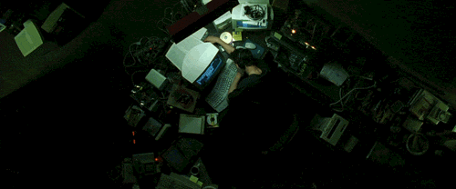

## Hello there, I'm Maxim!

I'm a passionate developer focused on AI, Fullstack Development, ML, mobile experiences and sometimes WEB3. Currently studiyng at the 3rd course of KBTU's Bachelor Degree in Information Systems.
Participant of Nfactorial(n!) Incubator 2025.

## My GH Stats

  
  

---

## Connect with me

  
  
  
  
  

  
See you soon...

  

